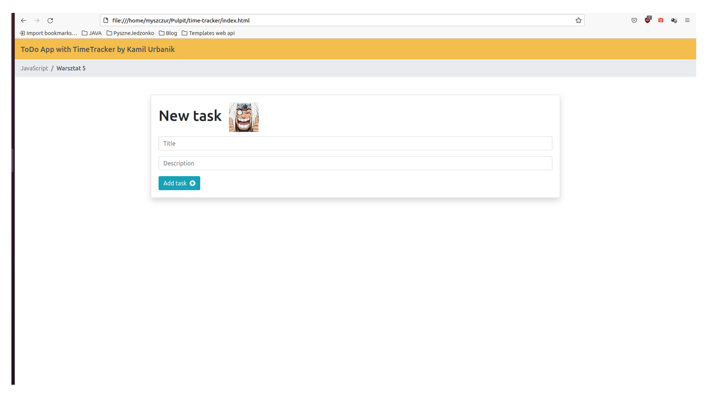

# Time Tracker

An application that allows you to manage tasks and the time of execution of these tasks.
Application written in JavaScript

## Tech Stack

**Client:** Visual Studio, JavaScript

## Authors

- [@Myszczur](https://www.github.com/Myszczur)

## Lessons Learned

During the development of this application, I learned to connect via JavaScript with external APIs.
I also learned a more complex use of JavaScript.

## Features

- Add new Task
- Delete Task
- Uncheck when task is ready
- Add subtasks
- Add task execution time

